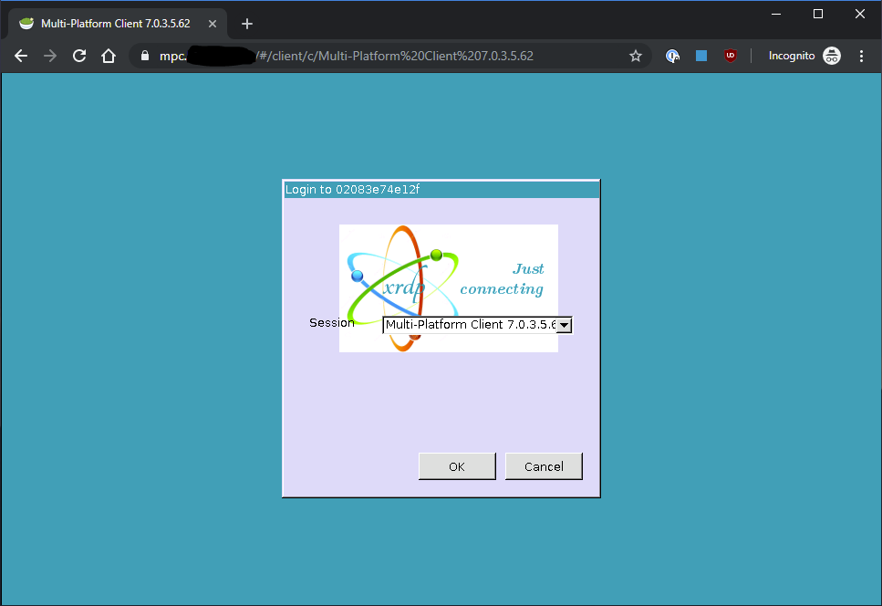
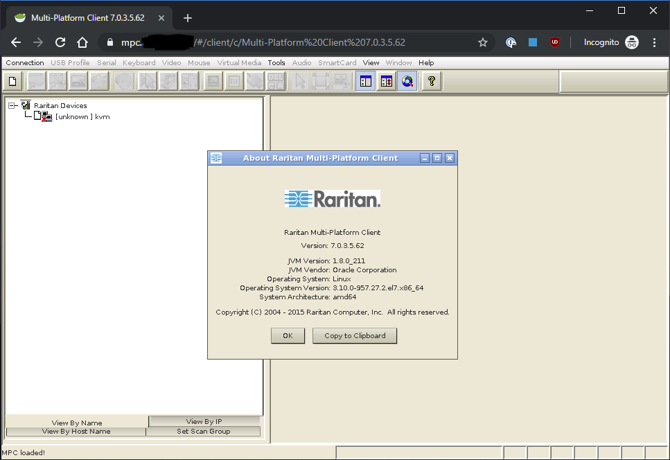

# raritan-mpc
The old Raritan KVM switches use unsigned applets in the web based java application.  Raritan has addressed this by creating a Multi-Platform client that can use an old version of Java installed on your machine.  This does not however fix the web interface.  The solution presented here is to run the apprioriate java environment in a docker container and export the session via an HTML5 interface and a remote desktop session. This will removes all client requirements and allows the app to be accessed from a chromebook with no required extensions. 

# Java issues
I have only been able to get this to work with the official Java 1.6 and jump through hoops to get it into this image.

# Security
There is none.  I personally use jwilder/docker-gen to publish the app to a hostname and secure it with client certificates.

# Login screen

# Application screen

# License
This package is MIT.
Binaries for Raritan MPC and Java JRE are not included in this package and are licensed by their respective owners.
